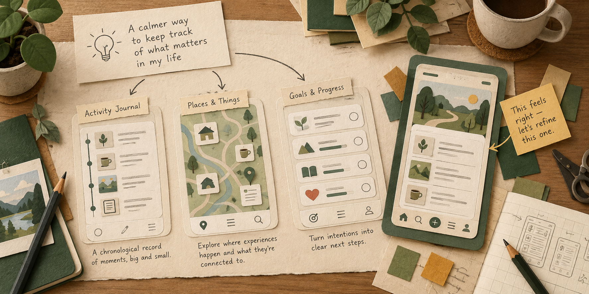

# Possibly

**Explore the experience before you build the app.**

Possibly helps you and your coding agent try different ways an app could work.
Start with an idea, compare visual concepts, choose a direction, and refine a
clickable prototype before committing to implementation.

The interesting difference is the **task**, not just the theme. A household repairs
app might start with “What can we finish this weekend?” or “What needs to be ready
before someone can fix this?” A pinball log might center on tonight’s session,
beating a personal best, or discovering an unplayed machine.

## Quick start: bring an idea to your agent

Give your coding agent this message, replacing the example with your own idea:

> Use [Possibly](https://github.com/robotdad/possibly) to explore an app for tracking
> household repairs. Read its [agent skill](https://github.com/robotdad/possibly/blob/main/skills/possibly/SKILL.md)
> for setup and usage. Show me different ways to approach the task, let me choose,
> then refine a clickable prototype.

Your agent installs and runs Possibly, opens its local review dashboard, and manages
refinements and export. You describe what matters, try the concepts, and choose what
to explore next. No repository checkout is needed.

### Before your first exploration

Use a coding agent that can install and run local tools and open a browser.
Possibly currently requires Python 3.12+, Git, uv, and Chromium; your agent can follow
the setup instructions to check these and install the tool and browser. This is a
local POC, validated on macOS.

Possibly uses **Amplifier Agent** for its intelligence and needs its own configured
model access. Your coding agent’s model access is not automatically shared with it.
Ask your agent to help configure a provider; complete any required sign-in yourself.
OpenAI is the default, with options including Anthropic, Gemini, Azure OpenAI,
GitHub Copilot, ChatGPT OAuth, and compatible local endpoints. One installation
supports them all, with provider components downloaded on first use. The dashboard
also has provider settings and connection tests.

### For the agent receiving this link

Start with the [agent skill](skills/possibly/SKILL.md) for installation, then read
`possibly --help` for the current tool-owned skill and interaction model.
The [caller guide](src/possibly/docs/caller-guide.md) covers library and CLI usage;
[provider setup](src/possibly/docs/providers.md) covers credentials and sign-in.

## What the loop looks like

1. **Explore.** Your agent supplies the brief. Possibly generates two or three
   concepts, optionally using different configured providers and models.
2. **Compare.** Browse thumbnail cards, open two live previews side by side, and
   try their screen navigation. Design rationale stays separate from the mockup.
3. **Choose and refine.** Each selected direction gets a focused workspace with
   version history and feedback. Keep exploring more than one if useful.
4. **Export.** Take a self-contained HTML prototype and a JSON handoff containing
   the brief, choices, assumptions, and mocked behavior to your implementation agent.

Tell your agent when you leave dashboard feedback. The dashboard saves submitted
feedback and drafts, but it does **not** wake the calling agent automatically.
Closing the browser tab also does not end a session; ask your agent to finish or stop it.

## What to expect

This is an exploration tool, not a production app builder. Prototypes simulate
behavior; exports need no network or companion assets, but generating them needs a
provider and Chromium. A passing interaction check is useful evidence, not proof
that every control or product assumption is correct.

Generation time and quality vary by model and brief. In our latest household and
pinball trials, the first concepts arrived in 28–38 seconds and full three-concept
batches took about 2–3 minutes. Earlier attempts failed too. The
[trial report](docs/DIVERSITY-EVALUATION.md) records timings, critiques, and limits
rather than promising a fixed wait. The illustration above is conceptual artwork,
not a product screenshot.

## Developing or contributing?

Clone the repository only when you want to work on Possibly itself.
[`AGENTS.md`](AGENTS.md#develop-from-this-checkout) covers checkout setup, tests,
architecture boundaries, and the contribution workflow.

## Go deeper

- [Agent usage and development workflow](AGENTS.md)
- [Library and CLI caller guide](src/possibly/docs/caller-guide.md)
- [Providers and settings](src/possibly/docs/providers.md)
- [Vision](docs/VISION.md) and [draft interaction contracts](contracts/interaction-api.v1.md)
- [Implementation notes](docs/IMPLEMENTATION.md) and [validation](docs/VALIDATION.md)

Bring an app idea and challenge whether the alternatives reveal something you
hadn’t considered. That is the most useful test of Possibly.
